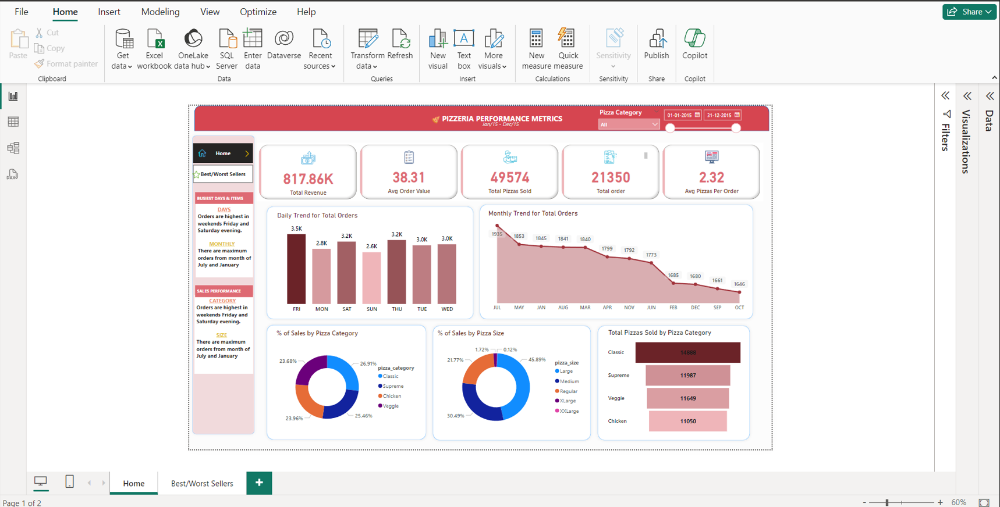

# Preview -  
## Live Demo - https://manitacin-my.sharepoint.com/:u:/g/personal/211114054_manit_ac_in/Ec-IAOHAdcJLlQfzoSIXTHQBnCIwc_MVfJQulAUGmei5-A?e=2luaCK 
              (Open this file in your PowerBI application)
# Pizza Performance Metrics

## Overview

Welcome to the Pizza Performance Metrics project! This project is designed to showcase advanced SQL skills and data visualization techniques using Power BI. The primary goal is to provide deep insights into pizza sales data, enabling businesses to optimize revenue, enhance customer satisfaction, and improve operational efficiency.

## Table of Contents

1. [Project Description](#project-description)
2. [Features](#features)
3. [Technologies Used](#technologies-used)
4. [Installation](#installation)
5. [Usage](#usage)
6. [How SQL Enhances Data Analysis](#how-sql-enhances-data-analysis)
7. [Power BI for Effective Visualization](#power-bi-for-effective-visualization)
8. [Future Enhancements](#future-enhancements)
9. [Contributing](#contributing)
10. [License](#license)

## Project Description

The Pizzeria Performance Metrics is a comprehensive dashboard that delves into the intricacies of pizza sales data. By utilizing MySQL for data queries and Power BI for visualization, this project transforms raw data into meaningful insights, helping businesses make data-driven decisions. The dashboard covers various aspects such as sales trends, customer preferences, inventory management, and market analysis.

## Features

- **Sales Insights:** Analyze sales records to identify top-performing pizzas and peak sales periods.
- **Revenue Optimization:** Discover key trends to increase potential revenue through targeted promotions.
- **Customer Behavior Analysis:** Segment customer data to reveal preferences and improve satisfaction.
- **Inventory Management:** Align stock levels with predictive sales patterns to enhance inventory turnover.
- **Dynamic Dashboards:** Create real-time, interactive dashboards with Power BI for actionable insights.
- **Market Trends:** Identify emerging trends and seasonal fluctuations to inform strategic decisions.

## Technologies Used

- **MySQL:** For writing advanced queries and managing the pizza sales database.
- **Power BI:** For creating dynamic and interactive visualizations.

## Installation

### Prerequisites

- MySQL installed and running on your local machine or server.
- Power BI Desktop installed on your computer.

### Steps

1. **Clone the repository:**
    ```bash
    git clone https://github.com/yourusername/pizza-profit-analyzer.git
    cd pizza-profit-analyzer
    ```

2. **Import the database:**
    - Open MySQL Workbench or your preferred MySQL client.
    - Create a new database called `pizza_sales`.
    - Import the provided SQL file (`pizza_sales.sql`) to set up the database schema and data.

3. **Set up Power BI:**
    - Open Power BI Desktop.
    - Connect to the MySQL database (`pizza_sales`) and load the data.
    - Open the provided Power BI file (`Pizzeria Performance Metrics.pbix`) to see the pre-built dashboards.

## Usage

1. **Run SQL Queries:**
    - Use the provided SQL scripts to run queries and generate insights on sales data.

2. **Explore Power BI Dashboards:**
    - Open Power BI Desktop.
    - Load the `Pizzeria Performance Metrics.pbix` file.
    - Explore the interactive dashboards to gain insights into various aspects of pizza sales.

## How SQL Enhances Data Analysis

SQL is a powerful tool for data analysis and manipulation. In this project, SQL was used to:

- **Extract and Transform Data:** Write complex queries to filter, aggregate, and join tables, transforming raw data into structured insights.
- **Identify Trends:** Use analytical functions to uncover patterns and trends in sales data.
- **Optimize Operations:** Develop queries that provide insights into inventory management, helping reduce waste and optimize stock levels.
- **Segment Customers:** Analyze customer data to create segments based on purchasing behavior, improving targeted marketing efforts.

## Power BI for Effective Visualization

Power BI enhances the data analysis process by providing:

- **Interactive Visuals:** Create interactive charts, graphs, and tables that allow users to explore data dynamically.
- **Real-Time Insights:** Connect to live data sources to ensure dashboards are always up-to-date.
- **Ease of Use:** Power BI’s intuitive interface makes it easy to build and customize visualizations without extensive technical knowledge.
- **Advanced Analytics:** Integrate advanced analytics and machine learning models directly into Power BI for deeper insights.
- **Collaboration:** Share dashboards with stakeholders, enabling collaborative data-driven decision-making.

## Future Enhancements

- **Predictive Analytics:** Integrate machine learning models to predict future sales trends.
- **Enhanced User Interface:** Improve the user interface of the Power BI dashboards for better user experience.
- **Additional Data Sources:** Incorporate data from additional sources like social media or customer feedback to enrich insights.

---

Thank you for exploring the Pizza Profit Analyzer! We hope this project demonstrates the powerful combination of SQL and Power BI in transforming data into actionable insights.
